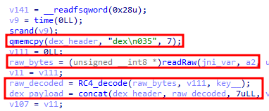

# Octo-2-Android-Banking-Trojan-analysis

The newly surfaced Octo II is an advanced variant of the Octo Android malware, which originally stems from the ExobotCompact banking Trojan family. First observed in 2024, Octo II is particularly menacing due to its enhanced capabilities for remote device takeover and its improved evasion techniques. It masquerades as trusted apps, such as Google Chrome and NordVPN, making it difficult for users to detect the threat.

Moreover, Octo II improves on previous versions by incorporating stronger anti-detection methods. Its code is heavily obfuscated and dynamically decrypted, making it harder for researchers and antivirus programs to detect and analyze. Initially, this malware has been detected targeting users in Europe, but its global impact is expected to grow as threat actors continue to use it for malicious campaigns. The malware also uses a domain generation algorithm (DGA), allowing it to quickly change C2 servers if one is blocked.

## Sample analyzed:

**MD5**: 653b7044dc5589e7888227cb47209d66
 
**SHA-1**: f2625c63fc9198c713047a0d388c5ec15f1fe67f
 
**SHA-256**: de5dfbb52d1356fdf20b76c6ccfc95aae4ecb82e3d8c034ce47a7bf4799f2ddb

## Unpacking process

The initial APK has a highly obfuscated code, which unpacks a DEX that is encrypted with RC4, using the key “ZHX”. 

The unpacked DEX hashes are: 

**MD5**: f33c4830b5770baa4c7238149147895b
 
**SHA-1**: 1199ff501b12bfaaa7a7cd42d92a11f6bffde688
 
**SHA-256**: 03a795e2623773c2590f001976b0fc1fbd88fd9e4f060de2b8f3456ac5f87e9e

Finally, when the DEX is decrypted, it is loaded through makeDexElements. This DEX has the following content, which is in charge of loading the native method “xuikytFoMOa” from the library “libctQLo6UEO.so”, which is present in the APK:

Inside this method the **“replace_loader”** method of the WrpClass library is called. This function has the following code, and aims to perform the following functions:

1. Unpack a new library dynamically, which is encrypted with RC4 (method unpack_dynlib):

As can be seen in the following image, the byte buffer to be decrypted is attached to a section of the original library itself. From there on, it takes 330,376 bytes and decrypts them using the RC4 algorithm, using as key **“wdwNQ508SVDCcJ03jR6IcZB3teA4bI1Q”**.

The unpacked library hashes are: 

**MD5**: 77dc50489b9323274732d27dc8a4e803
 
**SHA-1**: 0e02a3595b62489d0739d771881da8604d117c65
 
**SHA-256**: c5684e792d1ebefea6aac09fed45911703fd58c899f8a08133d49dd91429a820

2. Load this library into memory
3. Gets a pointer to the **“replace_loader”** method of this new library through the **“dlsym”** function and executes the **“replace_loader”** method of the new library.

The **replace_loader** method of the new library is very extensive. Although the part that really interests is this library is:

This method can be summarized in the following steps:

1. Read the encrypted DEX found in the path **“/AndroidManifest.xml/raw/mevmnp6w8u9ne”** of the original APK.
2. Decrypts it with the RC4 algorithm, using the key **“wL4NmkLuxo5MmH1biiw7hH02Cf09OLtm”**.
3. Adds the DEX header to the decrypted bytes, using the **“concat”** function.
4. Loads the DEX directly into memory without touching disk using the **InMemoryDexClassLoader** class.

The unpacked DEX data are: 

**MD5**: 4ccf4137d8ee1a30fac2f1d45f15b810
 
**SHA-1**: a7cf9cc55db678f411b47ebcb6469a2339540eb6
 
**SHA-256**: 3193515335ef3883735034687cd92b00378aef2a6090558e4d7fd83b4df381ea

This last decrypted DEX is the final Octo 2 payload.

## DGA (Domain generation algorithm):

A DGA (Domain Generation Algorithm) is a technique used to automatically generate a list of domain names dynamically. These domains are used by the malware to establish communication with its command and control (C2) servers. Instead of relying on a single server address that can be blocked by security measures, DGA allows the malware to generate multiple new domains, making it difficult for researchers and security solutions to stop communication between the malware and its C2.
If you analyze the final payload, you can see this function in charge of calling the function that performs the DGA:

After following a series of chained functions, we arrive at the final method, in charge of calling the **“filsQC9Ol”** method of the first library of all.This contains the following portion of code:

1. Initially, the **“replace_loader”** function, explained above, is executed.
2. Load this library in memory
3. Gets a pointer to the **“make_DGA”** method of this new library through the **“dlsym”** function and executes it.

The **“make_DGA”** method of the dynamically loaded library performs the following operations:

1. Copies the string *“kurbanguly”* to a char variable.
2. Gets the week of the year in which we are currently and stores it in a variable

3. Concatenate the following strings contained in the array *“array_1”*.

4. Finally, it performs the MD5 hash of this string, and then concatenates the string *“https://”* along with the TLD to the hash.

So the algorithm to generate the DGA is:

**https:// + MD5(“kurbanguly” + week_year + TLD + random_str + bot_tag) + TLD**

For example, for the following case the generated domain would be:

**Random String**: ODVlYjFkZWM4YT
**Bot tag**: aug30
**Week**: 37
**TLD**: top
**Final string**: kurbanguly37topODVlYjFkZWM4YTaug30
**MD5 hash**: 580a13a45faa7ebc35bcf73b578a0fc3
**Final domain**: https://580a13a45faa7ebc35bcf73b578a0fc3.top

## Traffic Encryption:

The traffic is encrypted with AES CBC and then encoded in Base64. However, the peculiarity of this new version of Octo is that the traffic encryption password is different for each request sent to the server. Therefore, it must be sent in each request made to the server, so that it is obfuscated in the *“Packets-sent”* header of the HTTP header of the request made. 

To form the new key, a method called **“make_AES_key”** of the previously dynamically loaded library is called. If you analyze the final payload, you can see this function in charge of calling the function that generates the encryption key, which initially calls the **“aczASG8a7c0S”** method of the first library, which is then in charge of dynamically loading the new library and calling the **“make_AES_key”** method.

The **aczASG8a7c0S** method is next, which, as in the case of DGA generation, calls **replace_loader** to dynamically load the library, and then calls the **“get_AES”** or **“get_salt”** method depending on the parameter passed to the function.

**“get_salt”** is in charge of generating the number sent in the *‘Packets-Sent’* HTTP header, and **get_AES** is in charge of generating the traffic encryption key. This last method obtains a pointer to the **“make_AES_key”** method of the dynamically loaded library through the **“dlsym”** function and executes it.

The **“make_AES_key”** method basically gets the length of the JSON to be encrypted and concatenates it to the string **“java/lang/Object”**. Afterwards, it makes the MD5 hash of the string (*JSON_length + “java/lang/Object”*). Finally, to obtain the traffic encryption key, it downloads the first 8 characters of the MD5, and from there it takes 16 characters.

The **“get_salt”** method of the original library gets a pointer to the **“get_salt”** method of the dynamically loaded library through the **“dlsym”** function and executes it.

The **“get_salt”* method called is responsible for obtaining the length of the JSON to be encrypted, multiplying this number by 512768 and finally making a string reverse to the string obtained.

This obtained value is sent in the *“Packets-sent”* field of the request, so that the C2 server can know the length of the JSON sent and therefore the key to decrypt it.

And this is the end of today's post. I hope you liked it, see you next time!

